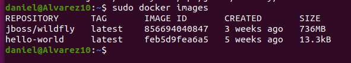

Daniel de Jesús Álvarez Miranda		2º DAW


# DOCKER


## Indice

[Instalar Docker](#item1)

[Trabajar con Docker](#item2)

[Administrar Docker](#item3)


<a name = "item1"></a>

## Instalar Docker

Instalamos algunos paquetes previos a la instalación de Docker.

```console
sudo apt install apt-transport-https ca-certificates curl software-properties-common
```


Luego añadimos la clave GPG para el repositorio oficial de Docker.

```console
curl -fsSL https://download.docker.com/linux/ubuntu/gpg | sudo apt-key add -
```


Agregamos el repositorio Docker a las fuentes APT.

```console
sudo add-apt-repository "deb [arch=amd64] https://download.docker.com/linux/ubuntu focal stable"
```


A continuación, actualizamos nuestros paquetes para que estén los que añadimos antes.

```console
sudo apt update
```


Nos aseguramos de realizar la instalación desde el repositorio Docker en vez del repositorio predeterminado de Ubuntu.

```console
apt-cache policy docker-ce
```


Se tendría que ver un mensaje parecido al siguiente:

```console

Installed: (none)

Candidate: 5:19.03.9~3-0~ubuntu-focal

Version table:

5:19.03.9~3-0~ubuntu-focal 500

    500 https://download.docker.com/linux/ubuntu focal/stable amd64 Packages

```

Empezamos la instalación de Docker.

```console
sudo apt install docker-ce
```


Comprobamos que funciona.

```console
sudo systemctl status docker
```


<a name = "item2"></a>

## Trabajar con Docker

Para comprobar que tenemos a Docker Hub, lanzamos el siguiente comando.

```console
docker run hello-world
```

Nos tendría que salir algo así:


<a name = "item3"></a>

## Administrar Docker

Para ver los contenedores activos, lanzamos el siguiente comando.

```console
sudo docker ps
```

Veremos algo así:


Visualizamos todos los contenedores, tanto activos como inactivos.

```console
docker ps -a
```


Por un error, creé una imagen de wildfly pero no afecta a nuestra práctica.


Para ver cual fue el último contenedor creado escribimos lo siguiente:

```console
docker ps -l
```


Listamos las imágenes de nuestro Docker.

```console
sudo docker images
```


