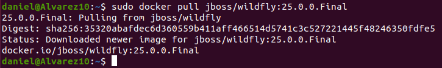
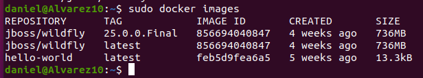
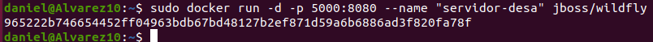
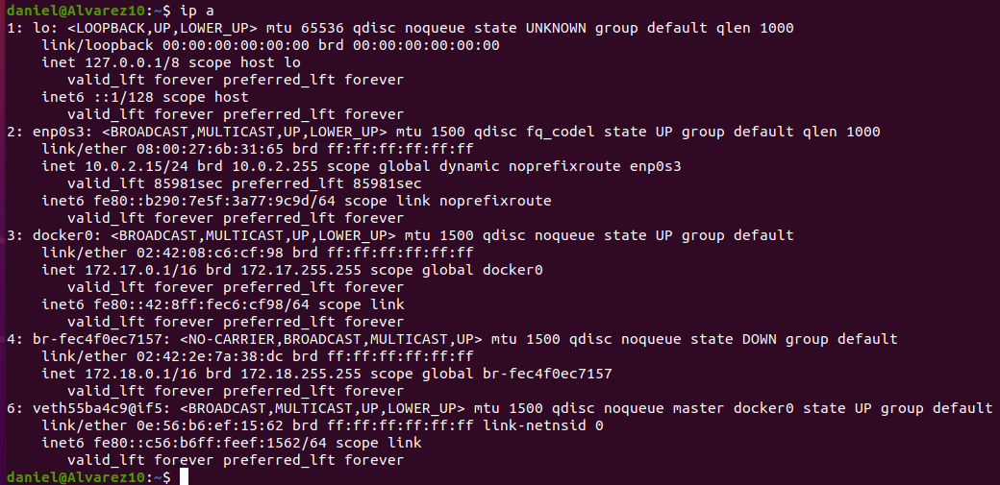
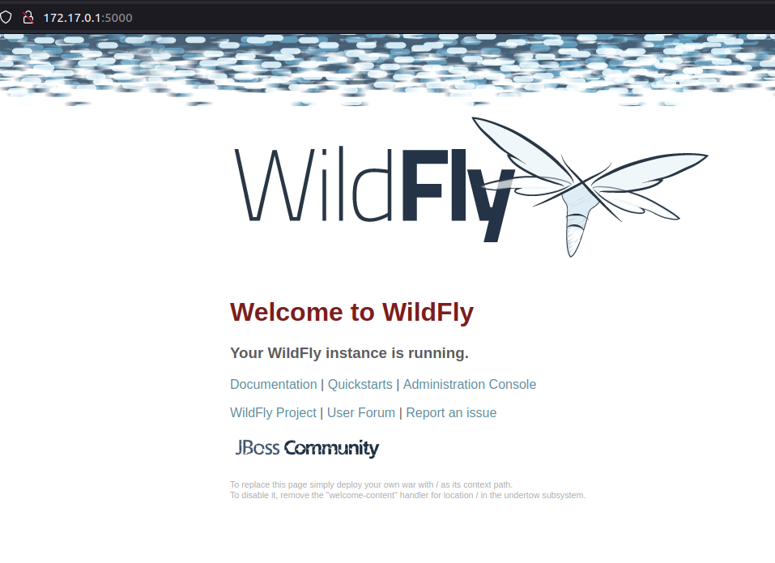

Daniel de Jesús Álvarez Miranda		2º DAW


# WILDFLY CON DOCKER


## Indice

[Descargar docker Wildfly](#item1)


## Descargar docker Wildfly

Para comenzar, tendremos que descargar la imagen de un contenedor o “docker” de Wildfly. También vamos a especificar la versión que queremos.

```console
sudo docker pull jboss/wildfly:25.0.0.Final
```

Nos dará algo parecido a esto:



Listamos las imágenes que hemos descargado.

```console
sudo docker images
```

Nos saldrá algo parecido a lo siguiente:




Ahora arrancamos un contenedor con dicho servidor.

```console
sudo docker run -d -p 5000:8080 --name "servidor-desa" jboss/wildfly
```



Luego listamos las IPs de nuestro equipo para averiguar cual ha cogido el docker y poder acceder a él mediante el navegador.

```console
ip a
```




Para acceder al contenedor del servidor, debemos poner en nuestro navegador la IP de dicho contenedor y el puerto 5000.


