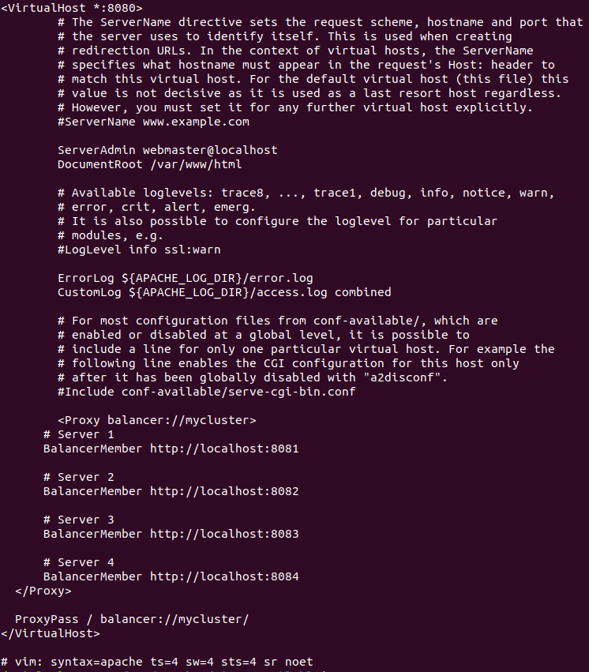

Daniel de Jesús Álvarez Miranda		2º DAW


# Balanceo de Carga en Apache


## Indice

[Activación de los módulos](#item1)

[Configuración de Apache.](#item2)

[Dockerfile](#item3)

[Docker-compose](#item4)

[Maven	7](#item5)

[Crear los contenedores](#item6)

[Comprobar](#item7)


## Activación de los módulos

Debemos activar todos los módulos necesarios para Apache. Recuerda usar sudo.

```console

a2enmod proxy

a2enmod proxy_http

a2enmod proxy_ajp

a2enmod rewrite

a2enmod deflate

a2enmod headers

a2enmod proxy_balancer

a2enmod proxy_connect

a2enmod proxy_html

a2enmod lbmethod_byrequests

```

Una vez activados los nodos, necesitamos reiniciar el servicio de Apache.
## Configuración de Apache.

Para que nuestro apache funcione con proxy-inverso, debemos de configurar el fichero de configuración por defecto. El 000-default.conf.

```console

<VirtualHost \*:80>

# Dejamos la configuración del VirtualHost como estaba

# sólo hay que añadir las siguiente directivas: Proxy y ProxyPass

<Proxy balancer://mycluster>

    # Server 1

    BalancerMember http://IP-HTTP-SERVER-1:8081

    # Server 2

    BalancerMember http://IP-HTTP-SERVER-2:8082

    # Server 3

    BalancerMember http://IP-HTTP-SERVER-3:8083

    # Server 4

    BalancerMember http://IP-HTTP-SERVER-4:8084

</Proxy>

    ProxyPass / balancer://mycluster/

</VirtualHost>

```




## Dockerfile

Usaremos un proyecto anterior donde ya teníamos un jsp. Dentro de este proyecto, creamos el fichero Dockerfile para Wildfly.


## Docker-compose

También crearemos un docker-compose para que cree 4 contenedores de wildfly en distintos puertos y nos sirva para balancear la carga.


## Maven

Una vez terminado, en la raíz del proyecto, lanzamos el comando de maven para que se descarguen todos los repositorios necesarios y se cree que .war.


## Crear los contenedores

Lanzamos el comando de docker-compose para que se instalen y creen los contenedores necesarios. Si tienes imágenes anteriores y tienen el mismo nombre, puede dar conflicto asi que se recomienda eliminar todas las imágenes antes.


## Comprobar

Comprobamos que está todo correctamente, para ello, iremos a un navegador y pondremos lo siguiente:

```console
localhost:8084/app-web-demo
```


Si funciona, comprobamos que el balanceo de carga también lo hace al no indicar un puerto específico. Como en el virtualhost de 000-default configuramos que escuche por 8080, entonces iremos ahí.

```console
localhost:8080/app-web-demo
```


