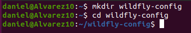
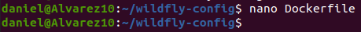
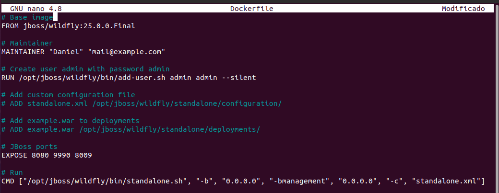
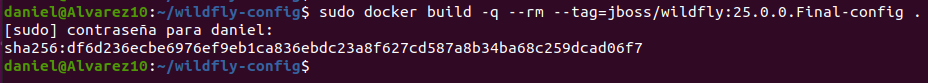
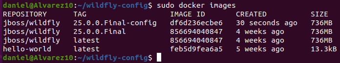
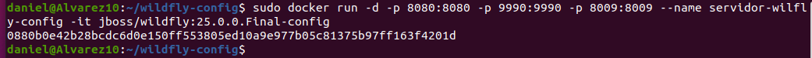
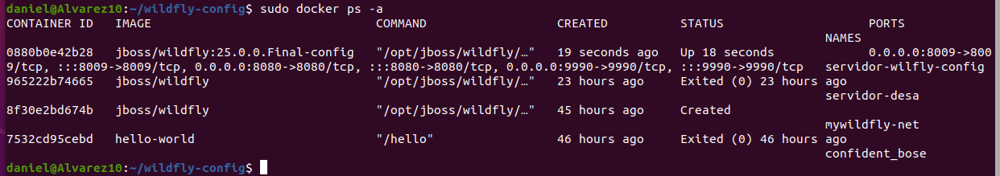
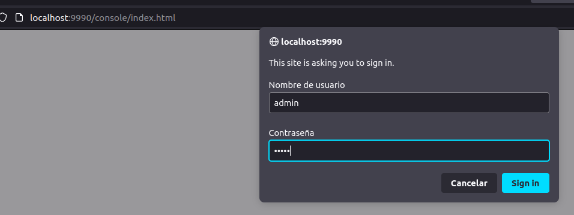
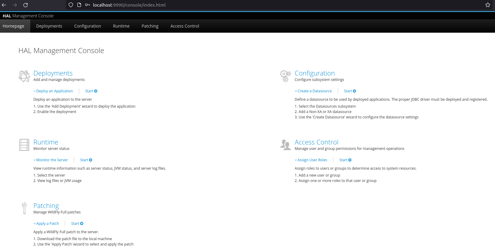

Daniel de Jesús Álvarez Miranda		2º DAW


# Dockerizando Wildfly


## Indice

[Crear Dockerfile para Wildfly](#item1)

[Usando la nueva imagen](#item2)


<a name = "item1"></a>

## Crear Dockerfile para Wildfly

Lo primero que debemos hacer, es crear el directorio “/wildfly-config” y nos situamos en ella.

```console

mkdir wildfly-config

cd wildfly-config

```




Creamos el fichero de configuración Dockerfile.

```console
nano Dockerfile
```



Añadimos lo siguiente:

```console

# Base image

FROM jboss/wildfly:25.0.0.Final

# Maintainer

MAINTAINER "Daniel" "mail@example.com"

# Create user admin with password admin

RUN /opt/jboss/wildfly/bin/add-user.sh admin admin --silent

# Add custom configuration file

# ADD standalone.xml /opt/jboss/wildfly/standalone/configuration/

# Add example.war to deployments

# ADD example.war /opt/jboss/wildfly/standalone/deployments/

# JBoss ports

EXPOSE 8080 9990 8009

# Run

CMD ["/opt/jboss/wildfly/bin/standalone.sh", "-b", "0.0.0.0", "-bmanagement", "0.0.0.0", "-c", "standalone.xml"]

```



Construimos la imagen (El punto al final del comando es importante).

```console
sudo docker build -q --rm --tag=jboss/wildfly:25.0.0.Final-config .
```



Verificamos que existe la imagen. Y con esto habremos terminado de construir la imagen.

```console
sudo docker images
```




<a name = "item2"></a>

## Usando la nueva imagen

Para probar la nueva imagen, lanzamos el siguiente comando.

```console
sudo docker run -d -p 8080:8080 -p 9990:9990 -p 8009:8009 --name servidor-wilfly-config -it jboss/wildfly:25.0.0.Final-config
```



A continuación, verificamos que el contenedor está arrancado.

```console
sudo docker ps -a
```




Para comprobar definitivamente que funciona, debemos ir al navegador y poner la ip que tendríamos configurada, en nuestro caso localhost. Además, poner que conecte por el puerto 8080.

Y entramos en administración. Para acceder, debemos poner el usuario que configuramos anteriormente por lo que en nuestro caso, será admin/admin.



Como podemos ver, tenemos acceso a Wildfly desde nuestro contenedor.


