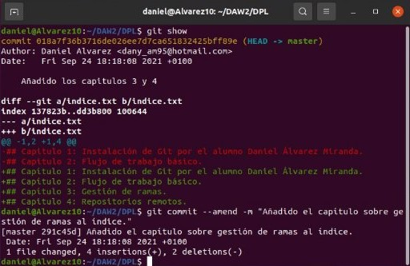

Daniel de Jesús Álvarez Miranda DAW – 2º B

# Manipulación de

# Repositorios en Git

***

## Indice

1. [Configuración...................................................................................................................................2](#_page1_x56.70_y110.45)
1. [Creación de un repositorio................................................................................................................2](#_page1_x56.70_y370.90)
1. [Comprobar el estado del repositorio.................................................................................................3](#_page2_x56.70_y119.50)
1. [Realizar Commit...............................................................................................................................4](#_page3_x56.70_y119.50)
1. [Modificación de Ficheros.................................................................................................................4](#_page3_x56.70_y396.40)
6. [Historial............................................................................................................................................5](#_page4_x56.70_y96.65)

***

## 1. Configuración.

**

Modificamos el archivo de configuración de git para personalizarlo con nuestro nombre, email y un color de interfaz.

## 2. Creación de un repositorio.

Crearemos un repositorio de la asignatura llamado DPL y luego mostramos su contenido.

## 3. Comprobar el estado del repositorio.

Creamos un fichero de texto y luego comprobamos el estado del repositorio. Podemos ver que hay cambios que no se han añadido en un commit.

Añadimos todos los cambios al commit y volvemos a comprobar el estado del repositorio. Como podemos ver, los cambios se han añadido.

## 4. Realizar Commit.

Vamos a lanzar el comando commit con un mensaje descriptivo. Esto nos ayudará en un futuro a la hora de encontrar un commit específico en nuestra rama.

## 5. Modificación de Ficheros.

Vamos a modificar el contenido del fichero indice.txt. Luego mostramos su contenido y mostramos los cambios respecto al último commit con el comando diff.

## 6. Historial.

Añadimos los cambios que hemos hecho en el fichero al commit y le añadir un mensaje descriptivo. Mostramos los cambios de la última versión del repositorio con respecto a la anterior. Después cambiamos el mensaje descriptivo del commit por otro y volvemos a mostrar los cambios.

