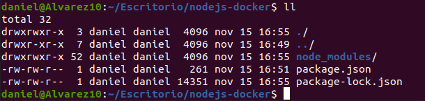
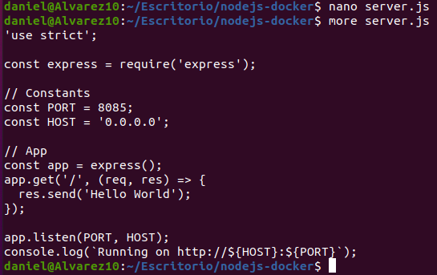
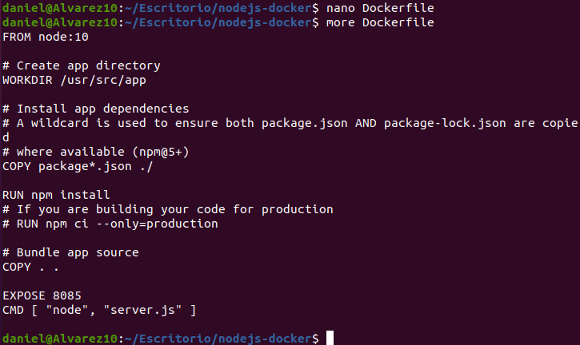
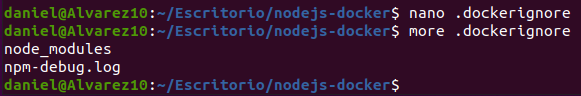
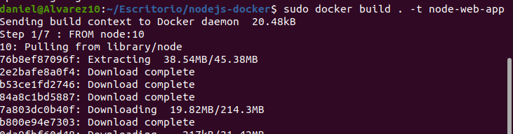
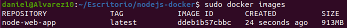
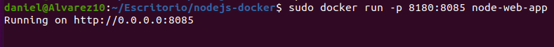
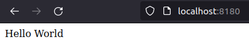

Daniel de Jesús Álvarez Miranda		2º DAW


# Desplegar Node.JS con Docker


## Indice

[NodeJS.app](#item1)

[DOCKERFILE](#item2)

[Construyendo la imagen](#item3)

[Iniciamos la imagen](#item4)

[Comprobar](#item5)


<a name = "item1"></a>

## NodeJS.app

Creamos un directorio y dentro de este creamos un fichero JSON que contenga lo siguiente:

```console
{
  "name": "docker_web_app",
  "version": "1.0.0",
  "description": "Node.js on Docker",
  "author": "First Last <first.last@example.com>",
  "main": "server.js",
  "scripts": {
    "start": "node server.js"
  },
  "dependencies": {
    "express": "^4.16.1"
  }
}
```




Si no tenemos npm instalado, podemos instalarlo con el comando:

```console
sudo apt install npm
```

Debemos asegurarnos que la versión sea superior a la 5. A continuación, creamos el proyecto con el comando:

```console
npm install
```

Al tener una versión superior a la 5, nos creará un fichero package-lock.json que copiaremos en nuestro docker image.

La estructura del proyecto actualmente es la siguiente:




Luego creamos el fichero server.js.

```console
'use strict';

const express = require('express');

// Constants
const PORT = 8080;
const HOST = '0.0.0.0';

// App
const app = express();
app.get('/', (req, res) => {
  res.send('Hello World');
});

app.listen(PORT, HOST);
console.log(`Running on http://${HOST}:${PORT}`);
```




<a name = "item2"></a>

## DOCKERFILE

Creamos el fichero Dockerfile y la configuramos de la siguiente manera:

```console
FROM node:16

# Create app directory
WORKDIR /usr/src/app

# Install app dependencies
# A wildcard is used to ensure both package.json AND package-lock.json are copied
# where available (npm@5+)
COPY package*.json ./

RUN npm install
# If you are building your code for production
# RUN npm ci --only=production

# Bundle app source
COPY . .

EXPOSE 8080
CMD [ "node", "server.js" ]
```



Creamos un fichero .dockerignore en el mismo directorio que el Dockerfile con lo siguiente:

```console
node_modules

npm-debug.log
```




<a name = "item3"></a>

## Construyendo la imagen

Nos situamos donde hayamos creado el fichero Dockerfile y lanzamos el siguiente comando.

```console
docker build . -t <your username>/node-web-app
```



Comprobamos que nuestra imagen se ha construido con el comando:

```console
sudo docker images
```




<a name = "item4"></a>

## Iniciamos la imagen

Con el siguiente comando, iniciamos la imagen que hemos creado anteriormente.

```console
docker run -p 49160:8080 -d <your username>/node-web-app
```

El puerto 49160 es el puerto que tendremos que poner en la url del navegador. En nuestro caso, pusimos 8180.




<a name = "item5"></a>

## Comprobar

Por último, comprobamos que todo está correctamente al ir al navegador y poner en la url:

```console
localhost:8180
```

Y nos debería dar algo como esto.


